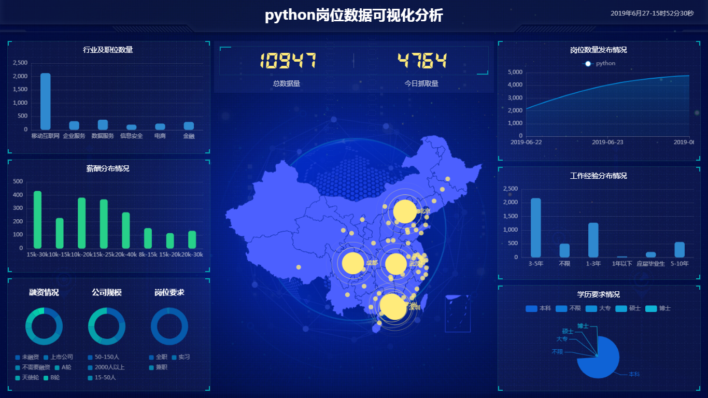

# imooc_spider_echarts_flask

Python爬虫实战数据可视化分析

#### 项目截图:

___

#### 项目文件
lagou_data_analysis 拉勾网岗位分析报告项目文件
lagou_spider 拉勾网爬虫项目文件
study_echarts 百度echarts学习文件

#### 运行方法
1、通过lagou_spider抓取相应岗位数据

2、启动lagou_data_analysis目录下的run.py
通过浏览器打开http://127.0.0.1/lagou 即可

3、修改handle_insert_data.py下的self.date日期